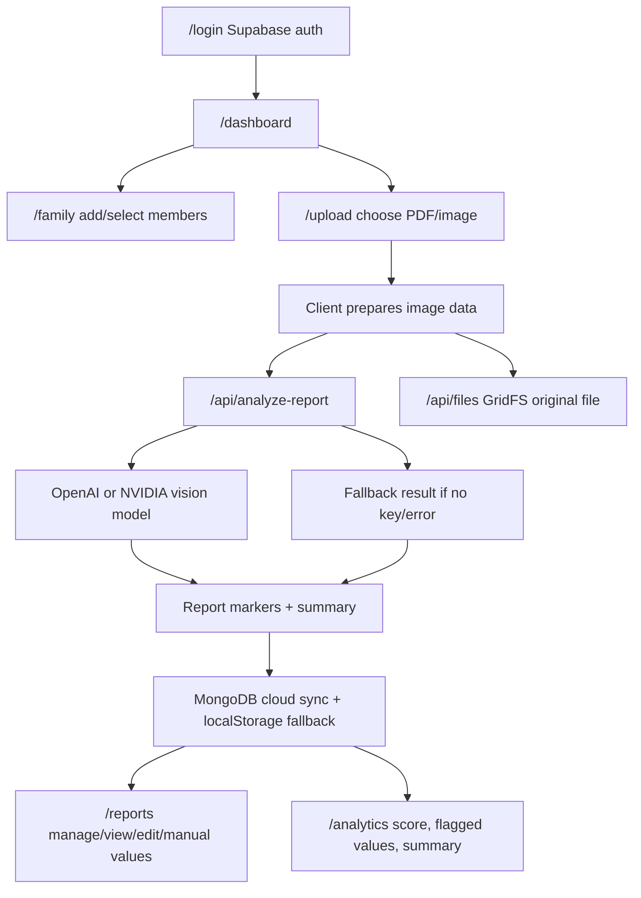

# MediVault Project Map

Use this note as the first context file before changing the project. It maps the actual codebase plus the larger planning documents so the project does not need to be re-explained every time.

## One-Line Summary

MediVault is a medical report vault app. The current working code is a Next.js web app with Supabase auth, MongoDB cloud sync for family/report data, MongoDB GridFS storage for original uploaded PDFs/images, local browser storage fallback, report upload, optional AI-based medical report extraction, manual health value entry, reports management, and analytics screens. The root documentation describes a broader product roadmap: FastAPI backend, PostgreSQL, Redis/Celery, AI/OCR, Flutter mobile app, analytics, testing, deployment, security, and compliance.

## Current Reality

- Actual runnable app lives in [[medivault-web/README|medivault-web]].
- Root package delegates build/start into `medivault-web`.
- Current UI is mobile-first, app-like, and built with Next.js App Router, React, TypeScript, and Tailwind.
- Auth is wired to Supabase when env vars are present.
- Family members and reports are stored in MongoDB through `/api/vault` after login, with `window.localStorage` as the instant/offline fallback.
- Upload accepts PDF/JPG/PNG. Original files are stored in MongoDB GridFS through `/api/files`, then PDF/image is converted to image data in the browser and posted to `/api/analyze-report`.
- AI analysis uses OpenAI by default, with optional NVIDIA provider support. If keys are missing or the model fails, the app returns a friendly fallback analysis.
- Planned backend/mobile/analytics/security docs are mostly specifications and roadmaps, not implemented server/mobile source code in this repo.

## App Flow



## Tech Stack

- Web: Next.js 14, React 18, TypeScript, Tailwind CSS.
- Auth: Supabase client auth.
- Data state today: React context plus MongoDB vault snapshots and localStorage fallback.
- Database: MongoDB via the official `mongodb` Node driver.
- File storage: MongoDB GridFS bucket `reportFiles` for original uploaded PDFs/images.
- AI extraction route: Next.js API route calling chat completions-compatible vision API.
- PDF handling: `pdfjs-dist` in the browser, first page only.
- HTTP future API client: Axios wrapper prepared for `NEXT_PUBLIC_API_URL`.
- Deployment docs mention Railway, Docker, Kubernetes, CI/CD, monitoring.
- Planned backend docs mention FastAPI, PostgreSQL, Redis, Celery, S3-compatible storage, JWT, RLS-style access control.

## Important Env Vars

- `NEXT_PUBLIC_SUPABASE_URL`: Supabase project URL.
- `NEXT_PUBLIC_SUPABASE_ANON_KEY`: Supabase anonymous key.
- `NEXT_PUBLIC_API_URL`: Future backend API base URL, default `http://localhost:8000/v1`.
- `MONGODB_URI`: MongoDB Atlas/Railway/local connection string for cloud vault persistence.
- `MONGODB_DB`: MongoDB database name, default `medivault`.
- `OPENAI_API_KEY`: Enables default AI analysis.
- `OPENAI_MODEL`: Defaults to `gpt-4o-mini`.
- `AI_PROVIDER`: Defaults to `openai`; set to `nvidia` for NVIDIA route.
- `NVIDIA_API_KEY`: Enables NVIDIA provider.
- `NVIDIA_BASE_URL`: Defaults to `https://integrate.api.nvidia.com`.
- `NVIDIA_MODEL`: Defaults to `meta/llama-3.2-11b-vision-instruct`.

## Run Commands

From repo root:

```bash
npm run build
npm run start
```

From `medivault-web`:

```bash
npm install
npm run dev
npm run build
npm run start
npm run format
```

Note: `npm run lint` exists but uses `next lint`, which may require matching Next.js lint setup.

## Main Code Map

### App Routes

- [[medivault-web/src/app/page.tsx]]: redirects/links into the app entry.
- [[medivault-web/src/app/layout.tsx]]: global layout, providers, metadata, global CSS.
- [[medivault-web/src/app/login/page.tsx]]: Supabase email/password sign in, sign up, and magic link.
- [[medivault-web/src/app/dashboard/page.tsx]]: main home dashboard, active member selector, health score, recent reports, attention items.
- [[medivault-web/src/app/family/page.tsx]]: add/edit/delete family members, active member selection, deletes linked reports with confirmation.
- [[medivault-web/src/app/upload/page.tsx]]: upload PDF/image, prepare image data, call AI route, update report status.
- [[medivault-web/src/app/reports/page.tsx]]: report list, search, filters, star, reviewed, edit, delete, details modal, manual value entry.
- [[medivault-web/src/app/analytics/page.tsx]]: score, scanned/flagged/verified cards, key parameter list, flagged toggle, smart summary.
- [[medivault-web/src/app/api/analyze-report/route.ts]]: AI extraction API route with provider selection, fallback handling, JSON parsing, marker cleanup.
- [[medivault-web/src/app/api/files/route.ts]]: authenticated original file upload route using MongoDB GridFS.
- [[medivault-web/src/app/api/files/[fileId]/route.ts]]: authenticated original file view/delete route.
- [[medivault-web/src/app/api/vault/route.ts]]: authenticated MongoDB vault load/save route.

### Shared Components

- [[medivault-web/src/components/app-data-provider.tsx]]: core local app state. Owns `FamilyMember`, `AppReport`, `ReportMarker`, add/update/delete methods, localStorage hydration/persistence, active member, report filtering.
- [[medivault-web/src/components/auth-provider.tsx]]: Supabase session tracking and `signOut`.
- [[medivault-web/src/components/mobile-shell.tsx]]: app shell, bottom navigation, icons.
- [[medivault-web/src/components/sign-out-button.tsx]]: auth sign-out UI.

### Libraries And API Layer

- [[medivault-web/src/lib/supabase.ts]]: creates Supabase client only when public env vars are present.
- [[medivault-web/src/lib/api-client.ts]]: Axios instance for future backend API calls, token setter/clearer, auth header interceptor.
- [[medivault-web/src/lib/mongodb.ts]]: shared MongoDB connection helper with serverless-safe cached client.
- [[medivault-web/src/lib/types.ts]]: broader planned domain types for users, profiles, family members, reports, files, extracted values, auth responses, API responses, pagination, health summary.
- [[medivault-web/src/lib/utils.ts]]: helper functions.
- [[medivault-web/src/lib/vault-types.ts]]: shared current app vault types for family members, reports, markers, and snapshots.
- [[medivault-web/src/lib/api/auth.ts]]: placeholder/future auth API service.
- [[medivault-web/src/lib/api/consents.ts]]: placeholder/future consent API service.
- [[medivault-web/src/lib/api/family.ts]]: placeholder/future family API service.
- [[medivault-web/src/lib/api/files.ts]]: placeholder/future file API service.
- [[medivault-web/src/lib/api/profile.ts]]: placeholder/future profile API service.
- [[medivault-web/src/lib/api/reports.ts]]: placeholder/future reports API service.

### Data And Static Assets

- [[medivault-web/src/data/dummy.ts]]: mock users/family/reports/values for planned API-like data.
- [[medivault-web/public/app-icon.svg]]: app icon.
- [[medivault-web/public/manifest.json]]: PWA manifest.

### Styling And Config

- [[medivault-web/src/app/globals.css]]: Tailwind globals and base styling.
- [[medivault-web/tailwind.config.js]]: Tailwind config.
- [[medivault-web/postcss.config.js]]: PostCSS config.
- [[medivault-web/next.config.js]]: Next config.
- [[medivault-web/tsconfig.json]]: TypeScript config.
- [[medivault-web/package.json]]: app dependencies and scripts.
- [[package.json]]: root build/start wrappers.
- [[Dockerfile]] and [[medivault-web/Dockerfile]]: deployment container files.
- [[START_LOCAL_SERVER.cmd]] and [[START_LOCAL_SERVER.ps1]]: Windows local server helpers.
- [[prototype.html]]: earlier standalone prototype.

## Data Model In Current App

Current model from `app-data-provider.tsx` and `vault-types.ts`:

- `FamilyMember`: `id`, `name`, `relation`, `score`, `bloodGroup`, `age`.
- `AppReport`: `id`, `title`, `category`, `lab`, `date`, `memberId`, `memberName`, `fileName`, `parameters`, `abnormal`, `status`, `starred`, `summary`, `markers`, `aiConfidence`, `createdAt`.
- `ReportMarker`: `name`, `value`, `range`, `status`.
- Report statuses: `Reviewed`, `Needs review`, `Watch`, `Normal`, `Processing`.
- Marker statuses: `Normal`, `High`, `Low`, `Watch`.
- MongoDB collection: `vaults`.
- MongoDB document shape: `{ userId, snapshot: { activeMemberId, familyMembers, reports }, createdAt, updatedAt }`.
- MongoDB GridFS bucket: `reportFiles`; report metadata stores `fileId`, `fileMimeType`, and `fileSizeBytes`.
- localStorage fallback key: `medivault-app-data-v2`.

## AI Extraction Behavior

- Browser upload accepts PDF or image.
- Images are compressed to JPEG with max side 1600px.
- PDFs are rendered with `pdfjs-dist`; current implementation sends only page 1.
- API route limits OpenAI images to 2 and NVIDIA images to 1.
- Image data over roughly 5.5M chars returns fallback.
- Model prompt asks for JSON: `title`, `category`, `summary`, `markers`.
- Returned markers are capped at 8.
- `abnormal` is count of markers not `Normal`.
- Result status becomes `Needs review` if abnormal, otherwise `Reviewed`.
- Fallback responses return HTTP 200 so the UI can still save a report with explanatory summary.

## Product Documentation Map

### Top-Level Status Docs

- [[PROJECT_SUMMARY]]: compact project overview.
- [[COMPLETE_STATUS]]: phases 1-7 status, working web app, stack, readiness, next actions.
- [[FINAL_PROJECT_STATUS]]: phases 1-11 final status, production-readiness framing, final statistics.
- [[PHASE6_PHASE7_SUMMARY]]: mobile and backend summary.
- [[MEDIVAULT_SPRINT_EXECUTION_PLAN]]: sprint-by-sprint execution plan.

### Web/UI Docs

- [[MEDIVAULT_UX_DESIGN_PLAN]]: UX strategy and product design plan.
- [[MEDIVAULT_SCREEN_LAYOUTS]]: 26 detailed screen specs, states, microcopy, mobile/web layout notes.
- [[MEDIVAULT_FRONTEND_MVP_PLAN]]: Next.js MVP architecture, pages, components, sprint plan.
- [[MEDIVAULT_PAGEWISE_IMPLEMENTATION]]: page-by-page implementation guide and developer checklist.
- [[FINAL_UI_IMPLEMENTATION]]: ready-to-use web and Flutter UI snippets plus design tokens.
- [[MEDIVAULT_WEB_CODE_GENERATOR]]: web code generation guidance.
- [[MEDIVAULT_FRONTEND_ANALYTICS_IMPLEMENTATION]]: analytics UI implementation plan.

### Backend/API Docs

- [[MEDIVAULT_BACKEND_API_SCHEMA]]: complete API schema and endpoints.
- [[MEDIVAULT_PHASE4_BACKEND_COMPLETE]]: backend implementation status/plan.
- [[MEDIVAULT_PHASE7_BACKEND]]: real backend plan with FastAPI, PostgreSQL, Redis, Celery, endpoints.
- [[MEDIVAULT_LOCAL_SETUP]]: local setup notes.
- [[MEDIVAULT_MONGODB_LIVE_SETUP]]: MongoDB Atlas/live deployment setup for current web app persistence.

### AI/OCR Docs

- [[MEDIVAULT_PHASE4_AI_OCR_INTEGRATION]]: OCR/AI integration plan, pipeline, tasks.
- [[MEDIVAULT_AI_EXTRACTION_SYSTEM]]: AI extraction prompts, system behavior, expected structured output.

### Analytics Docs

- [[MEDIVAULT_ANALYTICS_MODULE]]: backend analytics schema, SQL, materialized views, cache, API endpoints, security rules.
- [[MEDIVAULT_PHASE10_ADVANCED_ANALYTICS]]: advanced analytics roadmap.

### Mobile Docs

- [[MEDIVAULT_PHASE6_MOBILE_APP]]: Flutter mobile app plan.

### QA, DevOps, Security

- [[MEDIVAULT_PHASE8_TESTING_QA]]: testing and QA strategy.
- [[MEDIVAULT_PHASE9_DEVOPS_DEPLOYMENT]]: deployment and DevOps plan.
- [[MEDIVAULT_PHASE11_SECURITY_COMPLIANCE]]: security and compliance plan.

## Documentation Says vs Code Does

| Area | Docs Describe | Code Currently Has |
|---|---|---|
| Web app | Full MVP and many screens | Implemented core screens: login, dashboard, family, upload, reports, analytics |
| Auth | Phone/JWT/backend flows in some docs | Supabase email/password/magic link |
| Data storage | PostgreSQL/backend schema | MongoDB vault snapshots, GridFS original files, plus localStorage fallback |
| Backend | FastAPI, PostgreSQL, Redis, Celery, 40+ endpoints | No backend source here; only Next API route for AI |
| AI/OCR | Multi-step OCR pipeline and extraction review | Direct vision model extraction through `/api/analyze-report` |
| Analytics | SQL-backed analytics endpoints and trends | Client-side derived analytics from local reports |
| Mobile | Flutter app plan | No Flutter source in repo |
| Security/compliance | Full compliance roadmap | Supabase auth plus frontend privacy messaging; no full compliance implementation yet |

## Recommended Next Development Paths

1. Stabilize current web MVP: verify auth, upload, AI fallback, report edit/delete/manual entry, analytics empty states.
2. Harden MongoDB persistence: indexes, migration from localStorage, server-side validation, backup policy.
3. Add real file storage for uploaded PDFs/images.
4. Add real file storage: Supabase Storage, S3, or equivalent, with signed URLs.
5. Expand AI extraction: multi-page PDFs, confidence per marker, user review step, audit trail.
6. Add tests for the highest-risk paths: upload, AI route fallback, report CRUD, family deletion, auth redirects.
7. Reconcile docs with actual implementation so status docs stop overstating implemented backend/mobile pieces.

## Quick Orientation For Future Codex Sessions

Before editing:

- Read this note first.
- Then read the specific target file(s), usually under `medivault-web/src`.
- Treat root docs as product specs/roadmap unless the task asks to update documentation.
- Do not assume FastAPI/mobile backend source exists in this repo.
- Preserve the mobile-first app-shell style unless the user asks for a redesign.
- Keep MongoDB cloud sync plus localStorage fallback unless replacing persistence is explicitly part of the task.
- If touching AI upload, inspect both [[medivault-web/src/app/upload/page.tsx]] and [[medivault-web/src/app/api/analyze-report/route.ts]].
- If touching report data or analytics, inspect [[medivault-web/src/components/app-data-provider.tsx]], [[medivault-web/src/app/reports/page.tsx]], and [[medivault-web/src/app/analytics/page.tsx]].

## Full File Index

Root:

- [[COMPLETE_STATUS]]
- [[Dockerfile]]
- [[FINAL_PROJECT_STATUS]]
- [[FINAL_UI_IMPLEMENTATION]]
- [[MEDIVAULT_AI_EXTRACTION_SYSTEM]]
- [[MEDIVAULT_ANALYTICS_MODULE]]
- [[MEDIVAULT_BACKEND_API_SCHEMA]]
- [[MEDIVAULT_FRONTEND_ANALYTICS_IMPLEMENTATION]]
- [[MEDIVAULT_FRONTEND_MVP_PLAN]]
- [[MEDIVAULT_LOCAL_SETUP]]
- [[MEDIVAULT_MONGODB_LIVE_SETUP]]
- [[MEDIVAULT_OBSIDIAN_PROJECT_MAP]]
- [[MEDIVAULT_PAGEWISE_IMPLEMENTATION]]
- [[MEDIVAULT_PHASE10_ADVANCED_ANALYTICS]]
- [[MEDIVAULT_PHASE11_SECURITY_COMPLIANCE]]
- [[MEDIVAULT_PHASE4_AI_OCR_INTEGRATION]]
- [[MEDIVAULT_PHASE4_BACKEND_COMPLETE]]
- [[MEDIVAULT_PHASE6_MOBILE_APP]]
- [[MEDIVAULT_PHASE7_BACKEND]]
- [[MEDIVAULT_PHASE8_TESTING_QA]]
- [[MEDIVAULT_PHASE9_DEVOPS_DEPLOYMENT]]
- [[MEDIVAULT_SCREEN_LAYOUTS]]
- [[MEDIVAULT_SPRINT_EXECUTION_PLAN]]
- [[MEDIVAULT_UX_DESIGN_PLAN]]
- [[MEDIVAULT_WEB_CODE_GENERATOR]]
- [[PHASE6_PHASE7_SUMMARY]]
- [[PROJECT_SUMMARY]]
- [[START_LOCAL_SERVER.cmd]]
- [[START_LOCAL_SERVER.ps1]]
- [[package.json]]
- [[prototype.html]]

Web app:

- [[medivault-web/README]]
- [[medivault-web/Dockerfile]]
- [[medivault-web/.env.example]]
- [[medivault-web/next-env.d.ts]]
- [[medivault-web/next.config.js]]
- [[medivault-web/package-lock.json]]
- [[medivault-web/package.json]]
- [[medivault-web/postcss.config.js]]
- [[medivault-web/public/app-icon.svg]]
- [[medivault-web/public/manifest.json]]
- [[medivault-web/src/app/api/analyze-report/route.ts]]
- [[medivault-web/src/app/api/files/route.ts]]
- [[medivault-web/src/app/api/files/[fileId]/route.ts]]
- [[medivault-web/src/app/api/vault/route.ts]]
- [[medivault-web/src/app/analytics/page.tsx]]
- [[medivault-web/src/app/dashboard/page.tsx]]
- [[medivault-web/src/app/family/page.tsx]]
- [[medivault-web/src/app/globals.css]]
- [[medivault-web/src/app/layout.tsx]]
- [[medivault-web/src/app/login/page.tsx]]
- [[medivault-web/src/app/page.tsx]]
- [[medivault-web/src/app/reports/page.tsx]]
- [[medivault-web/src/app/upload/page.tsx]]
- [[medivault-web/src/components/app-data-provider.tsx]]
- [[medivault-web/src/components/auth-provider.tsx]]
- [[medivault-web/src/components/mobile-shell.tsx]]
- [[medivault-web/src/components/sign-out-button.tsx]]
- [[medivault-web/src/data/dummy.ts]]
- [[medivault-web/src/lib/api/auth.ts]]
- [[medivault-web/src/lib/api/consents.ts]]
- [[medivault-web/src/lib/api/family.ts]]
- [[medivault-web/src/lib/api/files.ts]]
- [[medivault-web/src/lib/api/profile.ts]]
- [[medivault-web/src/lib/api/reports.ts]]
- [[medivault-web/src/lib/api-client.ts]]
- [[medivault-web/src/lib/mongodb.ts]]
- [[medivault-web/src/lib/supabase.ts]]
- [[medivault-web/src/lib/types.ts]]
- [[medivault-web/src/lib/utils.ts]]
- [[medivault-web/src/lib/vault-types.ts]]
